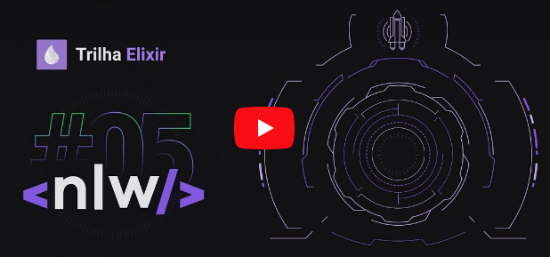

<h1 align="center">
    <b>NLW#5 <p style="color: #4B275F">Trilha de Elixir</p></b>
</h1>

<p align="center">
  
</p>

<p align="center">
  <a href="#sobre">Sobre</a>&nbsp;&nbsp;&nbsp;|&nbsp;&nbsp;&nbsp;
  <a href="#tecnologias-utilizadas">Tecnologias</a>&nbsp;&nbsp;&nbsp;|&nbsp;&nbsp;&nbsp;
  <a href="#pre-requisitos">Pré-requisitos</a>&nbsp;&nbsp;&nbsp;|&nbsp;&nbsp;&nbsp;
  <a href="#como-usar">Como usar</a>&nbsp;&nbsp;&nbsp;|&nbsp;&nbsp;&nbsp;
  <a href="#extras">Extras</a>
</p>

<a id="sobre"></a>

## :bookmark: Sobre

Backend construído em Elixir e Phoenix para envio de e-mails, no intuito de notificar sobre o vencimento de suprimentos dos restaurantes cadastrados pela aplicação.

<a id="tecnologias-utilizadas"></a>

## :rocket: Tecnologias Utilizadas

Foram também utilizadas as seguintes tecnologias

- [Elixir](https://elixir-lang.org/)
- [Phoenix](https://www.phoenixframework.org/)
- [Ecto](https://hexdocs.pm/ecto/Ecto.html)
- [Bamboo](https://github.com/thoughtbot/bamboo)
- [ExUnit](https://hexdocs.pm/ex_unit/ExUnit.html)

<a id="pre-requisitos"></a>

## :fire: Pré-requisitos

É preciso ter o Elixir, Phoenix e o Postgres instalados.
Para testes de requisição pode-se usar tanto Insominia quanto o Postman.

<a id="como-usar"></a>

## :zap: Como usar

```bash
  # Clone o repositório
  $ git clone git@github.com:dominguetigs/nlw5-elixir.git

  # Instale as dependências
  $ mix deps.get

  # Inicie o servidor Phoenix
  $ mix phx.server
```

Após rodar o servidor, acesse com [`localhost:4000`](http://localhost:4000)

<a id="extras"></a>

## :information_source: Extras

- [Site oficial do Phoenix](https://www.phoenixframework.org/)
- [Documentação](https://hexdocs.pm/phoenix)
- [Fórum](https://elixirforum.com/c/phoenix-forum)

---

<h4 align="center">
    Feito com 💙 by <a
      href="https://www.linkedin.com/in/gustavodomingueti/"
      target="_blank"
    >Gustavo Domingueti</a>
</h4>
